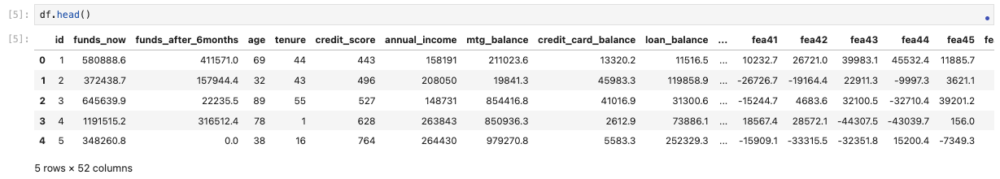
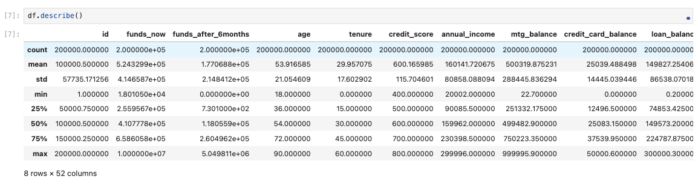
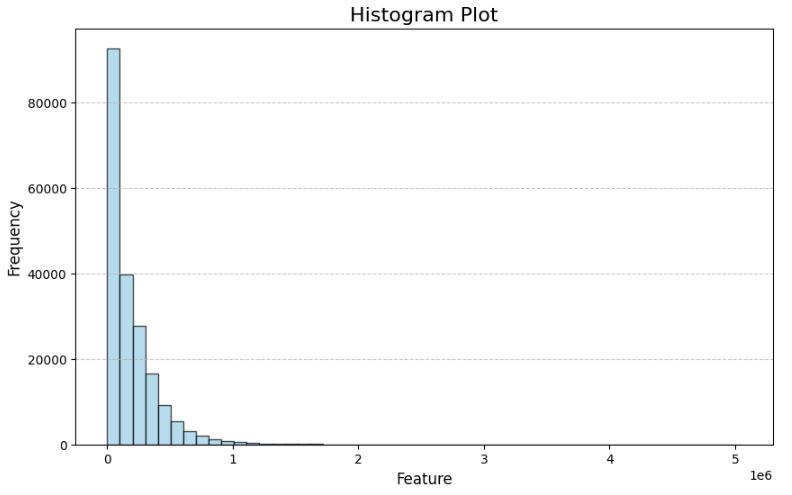
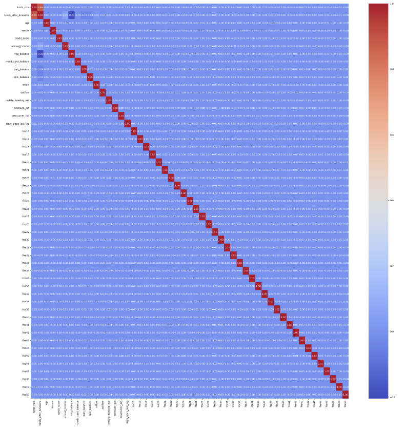
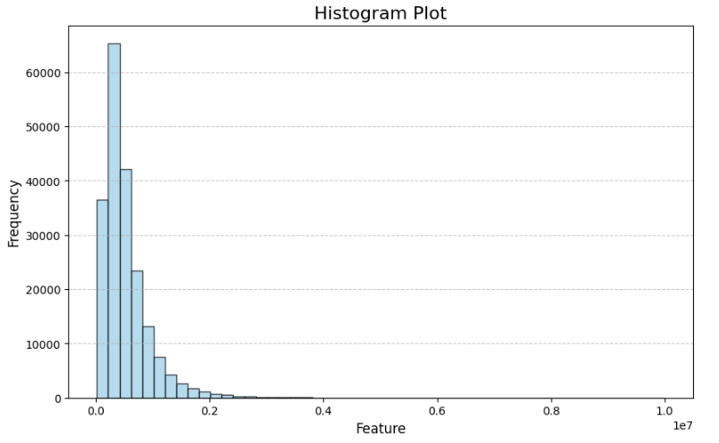
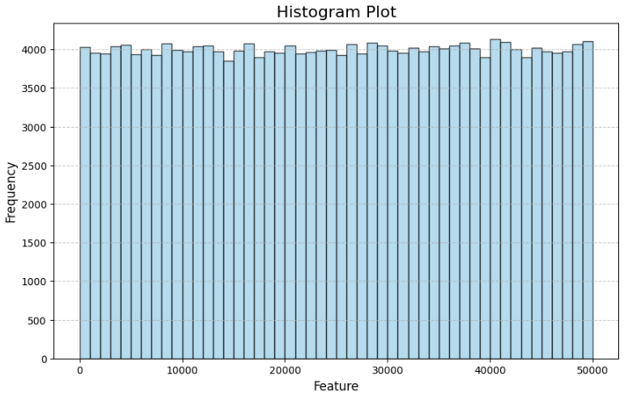
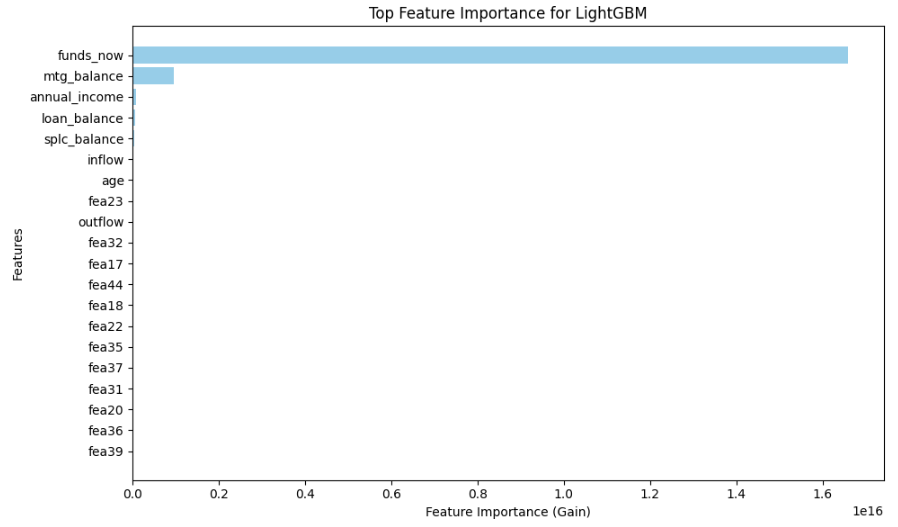

# Account Funds Prediction

## 1. Overview

* The objective of this project is to predict the future (post 6 months) funds balance of clients owning multiple accounts in a financial institution.
* Multiple Machine Learning regression models have been implemented, including Linear Regression, Random Forest, LightGBM, and XGBoost, with MLflow and HyperOpt.
* The Power Ratio (analogous to AUC for classification tasks) of the optimal model is impressive at 0.94, demonstrating a strong ability to rank clients effectively. 
> Due to NDA (Non-Disclosure Agreement), the dataset was manually generated to closely mimic the structure of real-world data. 

## 2. Version and Packages

* Python version: 3.9.10.

* Virtual environment: venv1 (Python virtual environment).

* Packages: all dependencies are listed in the "requirements.txt".

## 3. EDA

### 3.1 Overview

* The dataset comprises 200k rows and 52 columns. (1 target column, 1 ID column, and 50 features).
* The code regarding generating the dataset can be referenced in the "data" folder.

### 3.2 Basic statistics

### 3.3 Distribution of the target

* The target follows a classic long-tail (pareto) distribution.

### 3.4 Correlation 

* All features are weakly correlated, except "funds_after_6months" (target) and "funds_now".

### 3.5 Distribution of input features

* Funds now:

* Credit card balance:

## 4. Modeling results 

### 4.1 Key metric

| Model             | Training Power Ratio | Test Power ratio | Running time               |
|-------------------|----------------------|------------------|----------------------------|
| Linear Regression | 0.941                | 0.940            | 6.8s (backward selection)  |
| Random Forest     | 0.885                | 0.878            | 1.2h (32 fits HyperOpt)    |
| LightGBM          | 0.942                | 0.940            | 11.8s (32 fits HyperOpt)   |
| XGBoost           | 0.952                | 0.940            | 24.4min (32 fits HyperOpt) |

### 4.2 Other metrics

| Model             | Training RMSE | Test RMSE | Training R2 | Test R2 |
|-------------------|---------------|-----------|-------------|---------|
| Linear Regression | 85664.9       | 85301.3   | 0.841       | 0.842   |
| Random Forest     | 172067.8      | 173132.6  | 0.359       | 0.349   |
| LightGBM          | 85253.3       | 85355.9   | 0.843       | 0.842   |
| XGBoost           | 73908.8       | 82938.6   | 0.881       | 0.850   |

* Based on the above results, LightGBM and Linear Regression yielded the highest Power Ratio without overfitting. 
They are both efficient, but we are inclined to use LightGBM since it's more capable of capturing complex relationship, and more robust to outliers.

## 5. Feature Importance

* Top 3 vital features are current funds, mortgage balance, and annual income.

## 6. Conclusion

* Model selection: LightGBM was chosen over other models due to its balance of high performance (Power Ratio of 0.94) and ability to capture non-linear relationship while remaining efficient and robust to outliers.

* Key insights: the most critical predictors of future funds balance include current funds, mortgage balance, and annual income, highlighting their significant influence in driving model predictions.

* Future steps: incorporate additional data sources, conduct feature engineering, and experiment with other advanced models (e.g. neural networks) to enhance predictive capability. 

