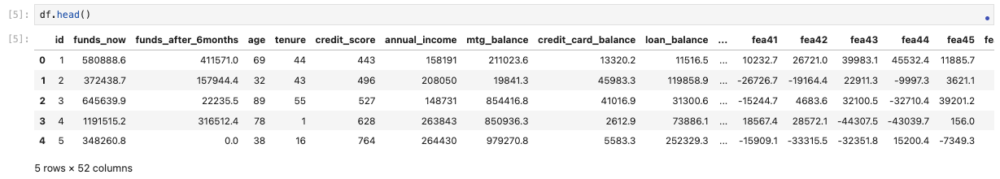
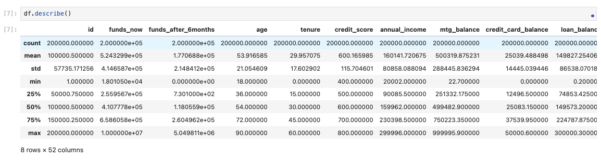
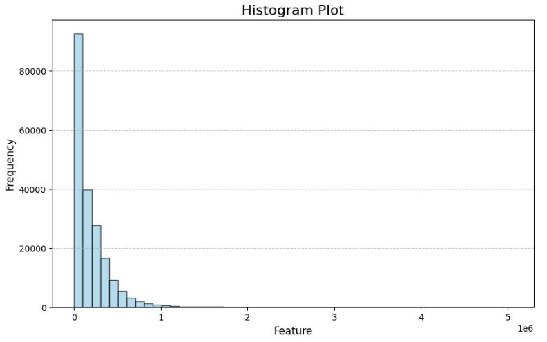
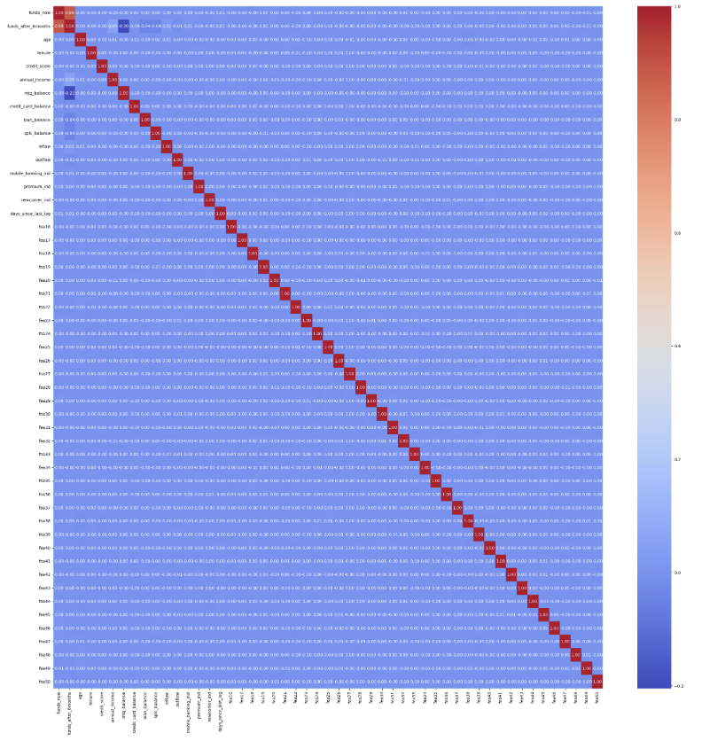
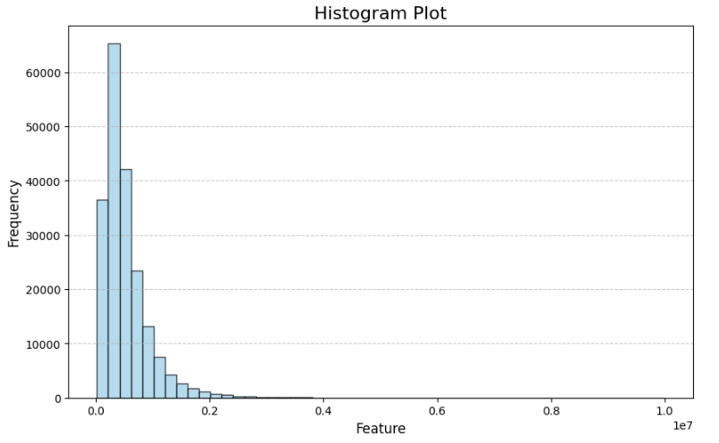
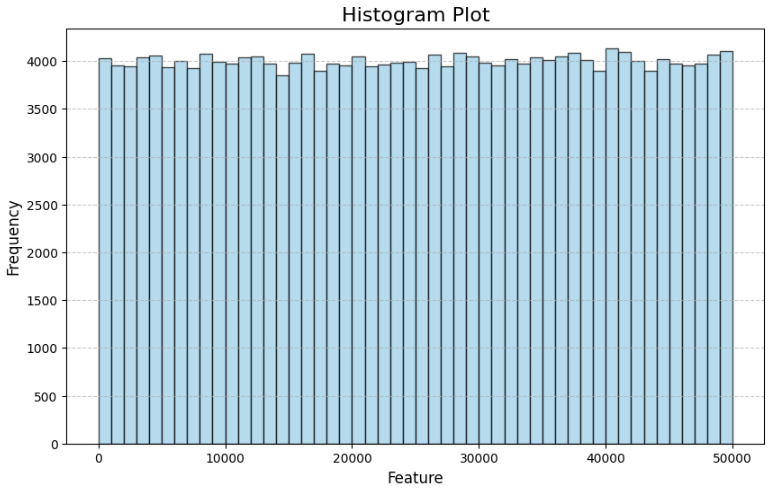

# Account Funds Prediction

## 1. Overview

* The objective is to predict the future funds balance of clients owning multiple accounts after 6 months for financial institution.
* Multiple ML regression models have been implemented, including Linear Regression, Random Forest, LightGBM, XGBoos, using MLflow and HyperOpt.
* The Power Ratio (analogous to AUC for classification tasks) of the optimal model is impressive at 0.94, demonstrating a strong ability to rank clients effectively. 
> Due to NDA (Non-Disclosure Agreement), the dataset was manually generated to closely mimic the structure of real-world data. 

## 2. Version and Packages

* Python Version: 3.9.10

* Environment: venv1 (virtual)

* Packages: see "requirements.txt"

## 3. EDA

### 3.1 Overview

* The dataset is comprised is 200k rows and 52 columns. (1 target column, 1 id column, 50 features).
* The code regarding generating sample data can be referenced in "data" folder.

### 3.2 Basic statistics

### 3.3 Distribution of the target

* It's a classic long-tail (pareto) distribution.

### 3.4 Correlation 

* All features are weakly correlated, except "funds_after_6months" (target) and "funds_now".

### 3.5 Distribution of input features

* Funds now:

* Credit card balance:

